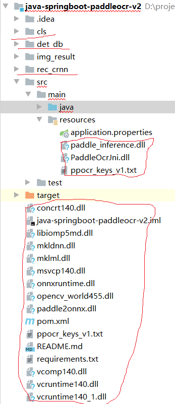
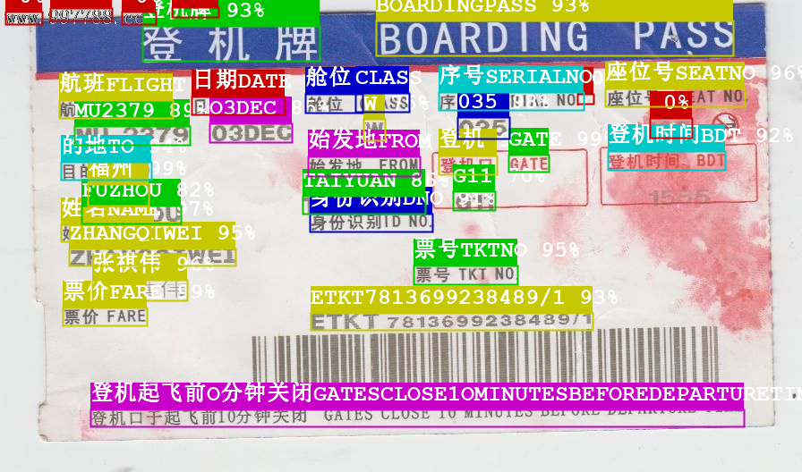

<h3 align="center">java-springboot-paddleocr-v2</h3>

<!-- TABLE OF CONTENTS -->

  
Table of Contents

  <ol>
    <li>
      <a href="#about">About</a>
    </li>
    <li>
      <a href="#getting-started">Getting Started</a>
    </li>
    <li>
          <a href="#result">Result</a>
        </li>
    <li>
      <a href="#contact">Contact</a>
    </li>
    <li>
       <a href="#reference">Reference</a>
    </li>
    
  </ol>

#### About

不同于[java-springboot-paddleocr](https://github.com/jiangnanboy/java-springboot-paddleocr) ，本项目利用JNI加载paddle-ocr的C++编译后的dll库，并利用springboot进行web部署访问，效果等同于java-springboot-paddleocr。

#### Getting started
paddle-ocr c++编译的dll库以及模型(det_db:文本检测；cls:文本方向；rec_crnn:文本识别)，下载后放入项目的相应位置如下图：

 

  

 

链接: https://pan.baidu.com/s/1_I3074n7WIv7Pyc_EoaBQA 提取码: fjh3

项目启动后访问 http://localhost:8080/swagger-ui/ 测试

 

  

 

其中：

1./ocr：返回json结果（包括识别的文字，坐标以及置信度）

2./ocr/image：返回识别后绘制的图片结果
#### Result
##### /ocr，返回json结果
    
    [{"box":[[101,458],[831,443],[831,462],[101,477]],"clsLabel":0,"clsScore":0.9893779,"score":0.9142323,"text":"登机起飞前O分钟关闭GATESCLOSE1OMINUTESBEFOREDEPARTURETIME"},
    {"box":[[347,350],[662,346],[662,365],[347,369]],"clsLabel":0,"clsScore":0.99999976,"score":0.9292435,"text":"ETKT7813699238489/1"},
    {"box":[[70,344],[164,341],[165,362],[71,364]],"clsLabel":0,"clsScore":1.0,"score":0.99424833,"text":"票价FARE"},
    {"box":[[103,313],[209,310],[210,333],[104,336]],"clsLabel":0,"clsScore":1.0,"score":0.9641626,"text":"张祺伟"},
    {"box":[[462,297],[578,295],[578,315],[462,318]],"clsLabel":0,"clsScore":0.9999988,"score":0.94890064,"text":"票号TKTNO"},
    {"box":[[77,278],[263,274],[263,294],[77,297]],"clsLabel":0,"clsScore":1.0,"score":0.94635695,"text":"ZHANGQIWEI"},
    {"box":[[68,251],[172,249],[172,268],[68,270]],"clsLabel":0,"clsScore":1.0,"score":0.9733718,"text":"姓名NAME"},
    {"box":[[346,239],[483,235],[483,255],[346,259]],"clsLabel":0,"clsScore":1.0,"score":0.91015244,"text":"身份识别DNO"},
    {"box":[[91,230],[202,228],[202,248],[91,250]],"clsLabel":0,"clsScore":0.999033,"score":0.82490426,"text":"FUZHOU"},
    {"box":[[338,219],[475,216],[475,236],[338,239]],"clsLabel":0,"clsScore":1.0,"score":0.8636264,"text":"TAIYUAN"},
    {"box":[[506,214],[553,214],[553,235],[506,235]],"clsLabel":0,"clsScore":0.5980619,"score":0.6953351,"text":"G11"},
    {"box":[[98,206],[166,204],[167,228],[99,230]],"clsLabel":0,"clsScore":0.9999995,"score":0.9914566,"text":"福州"},
    {"box":[[68,181],[169,178],[169,198],[68,201]],"clsLabel":0,"clsScore":0.9999999,"score":0.9419906,"text":"的地TO"},
    {"box":[[344,175],[469,171],[469,193],[345,197]],"clsLabel":0,"clsScore":1.0,"score":0.99677646,"text":"始发地FROM"},
    {"box":[[490,174],[555,172],[556,193],[491,195]],"clsLabel":0,"clsScore":0.99999833,"score":0.92120004,"text":"登机"},
    {"box":[[568,173],[613,173],[613,192],[568,192]],"clsLabel":0,"clsScore":1.0,"score":0.99297625,"text":"GATE"},
    {"box":[[679,169],[810,166],[810,187],[679,190]],"clsLabel":0,"clsScore":1.0,"score":0.9191831,"text":"登机时间BDT"},
    {"box":[[83,141],[212,137],[212,158],[83,162]],"clsLabel":0,"clsScore":0.99999845,"score":0.8854566,"text":"MU2379"},
    {"box":[[234,138],[326,136],[326,157],[234,159]],"clsLabel":0,"clsScore":0.99988997,"score":0.8469051,"text":"O3DEC"},
    {"box":[[406,133],[430,133],[430,157],[406,157]],"clsLabel":0,"clsScore":0.8780533,"score":0.7521334,"text":"W"},
    {"box":[[726,132],[773,132],[773,154],[726,154]],"clsLabel":0,"clsScore":0.8853147,"score":0.0,"text":""},
    {"box":[[511,131],[569,131],[569,155],[511,155]],"clsLabel":0,"clsScore":0.9968528,"score":0.97677803,"text":"035"},
    {"box":[[66,112],[193,108],[193,128],[66,132]],"clsLabel":0,"clsScore":0.99999833,"score":0.90373456,"text":"航班FLIGHT"},
    {"box":[[214,108],[318,106],[318,126],[214,128]],"clsLabel":0,"clsScore":1.0,"score":0.8624909,"text":"日期DATE"},
    {"box":[[341,105],[405,105],[405,126],[341,126]],"clsLabel":0,"clsScore":0.99999976,"score":0.9896834,"text":"舱位"},
    {"box":[[397,104],[457,104],[457,125],[397,125]],"clsLabel":0,"clsScore":0.99993443,"score":0.95271266,"text":"CLASS"},
    {"box":[[645,105],[663,105],[663,116],[645,116]],"clsLabel":0,"clsScore":0.546068,"score":0.0,"text":""},
    {"box":[[490,103],[652,100],[652,120],[490,123]],"clsLabel":0,"clsScore":1.0,"score":0.8552721,"text":"序号SERIALNO."},
    {"box":[[676,99],[832,96],[832,115],[676,119]],"clsLabel":0,"clsScore":1.0,"score":0.9639348,"text":"座位号SEATNO"},
    {"box":[[159,29],[357,26],[357,66],[159,68]],"clsLabel":0,"clsScore":1.0,"score":0.92540216,"text":"登机牌"},
    {"box":[[420,23],[819,15],[820,54],[421,62]],"clsLabel":0,"clsScore":1.0,"score":0.93226165,"text":"BOARDINGPASS"},
    {"box":[[136,13],[174,13],[174,27],[136,27]],"clsLabel":0,"clsScore":0.5823542,"score":0.0,"text":""},
    {"box":[[6,13],[47,13],[47,27],[6,27]],"clsLabel":0,"clsScore":0.5218532,"score":0.0,"text":""},
    {"box":[[56,9],[125,9],[125,23],[56,23]],"clsLabel":0,"clsScore":0.57580894,"score":0.0,"text":""},
    {"box":[[192,8],[244,8],[244,19],[192,19]],"clsLabel":0,"clsScore":0.69533056,"score":0.0,"text":""}]
        
##### /ocr/image，返回图片结果

   

  

  

#### Contact
如有问题，联系我：

1、github：https://github.com/jiangnanboy

2、QQ:2229029156

#### Reference
https://github.com/PaddlePaddle/PaddleOCR

https://github.com/jiangnanboy/doc_ai

https://github.com/deepjavalibrary/djl

https://github.com/jiangnanboy/java-springboot-paddleocr

https://github.com/greycode/ocrlite

